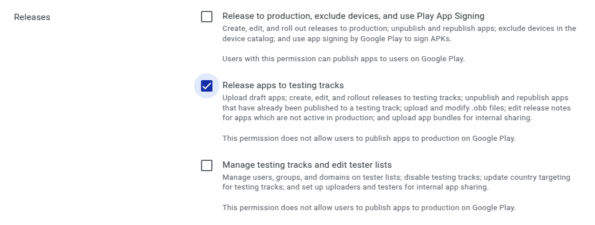

# Kiwix Android Custom Apps

Kiwix Android custom apps are Android apps running [Kiwix for
Android](https://github.com/kiwix/kiwix-android) against a
pre-configured ZIM file.

Kiwix publishes more than [a dozen of such
apps](https://play.google.com/store/apps/collection/cluster?clp=igM6ChkKEzkxMTYyMTU3Njc1NDE4NTc0OTIQCBgDEhsKFW9yZy5raXdpeC5raXdpeG1vYmlsZRABGAMYAQ%3D%3D:S:ANO1ljKl_Lw&gsr=Cj2KAzoKGQoTOTExNjIxNTc2NzU0MTg1NzQ5MhAIGAMSGwoVb3JnLmtpd2l4Lmtpd2l4bW9iaWxlEAEYAxgB:S:ANO1ljLrUVU). [Wikimed
- Offline Medical
Wikipedia](https://play.google.com/store/apps/details?id=org.kiwix.kiwixcustomwikimed)
and [Wikivoyage - Offline Travel
Guide](https://play.google.com/store/apps/details?id=org.kiwix.kiwixcustomwikivoyage)
being the most famous ones.

This project contains data and scripts needed to create specific
 custom Kiwix Android apps.  _It does *not* create the app_, that's
 done separately by running the relevant Gradle command to build one
 or more custom apps.

[](https://github.com/kiwix/kiwix-android-custom/actions/workflows/cd.yml?query=event%3Arelease)
[](https://www.gnu.org/licenses/gpl-3.0)

## Disclaimer

This document is for publishers who aim to publish new custom apps. If
you are a developer and want to have an in-depth understanding about
the custom apps, please read [CONTRIBUTING.md](CONTRIBUTING.md).

## Custom app folder

[In the repository](https://github.com/kiwix/kiwix-android-custom),
each custom configuration is isolated in a so called custom app
folder. If you need to create a new one for a new custom app, you can
do that easily using Github UI. Go to
https://github.com/kiwix/kiwix-android-custom/new/main, put the name
of your app (no space, lowercase only) and add a slash at the end.

## Description json file

The configuration of the custom app is handled using the `info.json`
file which is in the custom app folder. Take example on an already
existing one if you need to create a new custom app. The most
important fields are:
- `app_name`, the title of the app
- `zim_url`, the ZIM online URL (to download to create the app)
- `enforced_lang`, the language code of the content (and the app UI)
- `disable_sidebar`, a boolean value, when set to `true`, it hides the sidebar
- `disable_tabs`, a boolean value, when set to `true`, it deactivates the multi-tabs feature
- `disable_read_aloud`, a boolean value, when set to `true`, it disable the text-to-speech feature
- `disable_title`, a boolean value, when set to `true`, it disable the app title and set the app icon to hamburger
- `disable_external_links`, a boolean value when set to `true`, it disables the external link popup
  and hides the external links preference from the settings.
- `about_the_app`, a URL, when it is set, it adds an `About app_name app` item to the sidebar
  `app_name` will be replaced with the actual app name. Clicking it opens the URL in an external web browser
- `support_url`, a URL, when it is set, it adds an `Support app_name` item to the sidebar
  `app_name` will be replaced with the actual app name. Clicking it opens the URL in an external web browser
- `new`, A boolean value, when set to `true`, it triggers the creation
  and storage of a dummy release Bundle during the current workflow
  run.
- `upload_bundle` A boolean value. When set to true, it uploads the bundle to the Play Store,
  Otherwise, it uploads the APK.

You can also create this new file using Github IO. Go to
https://github.com/kiwix/kiwix-android-custom/new/main and type
`info.json`.

Remark: If you make a simple update, just replace the `zim_url` with
the latest available zim from
[download.kiwix.org/zim](https://download.kiwix.org/zim). Then comment
your commit (e.g. "updated to YYYY-MM zim") and commit directly to
`main` branch. You won't have to change anything more than this
(just tagging the release, see below).

## Icon master

The Icon master is file `icon.png` you find (or have to create) in the
custom app folder. It is a square PNG file which is used as master to
create the Icon set (see section below). This master has to match many
constraints and you might even have to create an `icon_foreground.png`
and `icon_baground.png` to achieve to do certain things. Look at the
[Android documentation about adaptive
icons](https://developer.android.com/guide/practices/ui_guidelines/icon_design_adaptive)
to know more.

## Icon set

The Android custom app needs an _Icon set_ to build properly. This
Icon set is needed to properly show the app icon on user devices and
is a list of bitmap pictures which are derivatives of an icon master.

To create this Icon set, follow these steps:

1. Create a new empty project with Android Studio (add no activity >
next > finish)
1. In the project view (top left) there should be a dropdown that says
 `Android` select that and choose `Project`, this will make the
 project view display accurately to the file system
1. Delete `MyApplication/app/src/main/res`
1. Right click `MyApplication/app` in android studio, click `New>Image
Asset` to open Asset Studio (if this option is greyed out you will
have to wait for indexing to finish, this shouldn't take longer than 2
minutes)
1. For `foreground layer` `Source Asset > Asset Type` choose `Image`
1. For `path` click the folder icon and browse to the output of
`gen-std-icon.py`
1. For `background layer` `Source Asset > Asset Type` choose `Color`
1. Click on the color box
1. This should present the color chooser, the box in the top right
 with the label `#` should be auto selected.  Type `FFFFFF` to supply
 white as the color, this is typically the color used
1. [Optional] go back to foreground layer and size the icon as
appropriate with the slider
1. Next > Finish will generate a res folder with all the icons needed in
the location where you previously deleted the res folder.
1. Cut and paste the res folder to
`kiwix-android-custom/whatever-directory-this-icon-set-is-for`

These instructions are for a first time setup, you can reuse this
project in the future for icon generation so many steps can be
omitted.

## Version name

The custom app will have a version name displayed on the Google Play
store. This version name has to be a date in the format YYYY-MM (for
example `2018-10`. This version name should be the date of the content
(neither the date of the Software nor the release date).

The app version name is determined in that order:
1. The date can be hardcoded in the json file at the key
`version_name`. Considering that this needs maintenance and that the
publisher can easily create a discrepency with the ZIM content date,
this should probably be avoided in most of the time.
1. If nothing is specified in the json, then it tries to extract it
from the ZIM file name. If the file - specified in `zim_url` - is
`wikipedia_en_all_maxi_2018-10.zim` then it will be `2018-10`.
1. Otherwise the current date will be put (should be avoided).

## Releasing

Simply tag the repo in git with the name of a custom app, for example:
```bash
git tag -f tunisie
git push -f origin tunisie
```

then Go to the [release
 tab](https://github.com/kiwix/kiwix-android-custom/releases) and
 click on "Draft a new release". As "tag version" use the custom app
 folder name (e.g. `wikimedar`). Publish by adding for example "WikiMed FA
 2021-06" as title, no description is needed.

This triggers a [Github
 action](https://github.com/kiwix/kiwix-android-custom/actions) that
 will build an app Bundle using kiwix-android main branch and the
 illustrations/icons set/json defined in this repository.

The very first release has to be done manually. Put the `new`
[attribute](#description-json-file) so the release management action
provides you the dummy first bundle to upload.

All other further releases (without the `new` attribute in the
 `json.info`) are then uploaded automatically to the Google Play app
 store as draft. Therefore, once released, go then to the [Google Play
 Store Admin dashboard](https://play.google.com/apps/publish) for the
 corresponding app and go to menu "Publication management" > "App
 version": under "Internal Testing", you can click on "Modify
 version". After a couple of hours the new version of the app should
 be listed in the public Play Store.

## Releasing in your organisation

If you want to publish the application in your organization(Play store account),
kiwix requires a service account JSON file to automatically publish your app on play store.

### How to create Service Account

1. You need a GCP(Google Cloud Platform) account for this.
2. Create a project for your application in the GCP.
3. Enable the [AndroidPublisher](https://console.cloud.google.com/apis/library/androidpublisher.googleapis.com) API for that GCP project.
4. Create a [service account and key](https://console.cloud.google.com/apis/credentials/serviceaccountkey)
    1. Make sure you're in the GCP project you used above (check the `project` query param in the
       URL)
    2. Select `New service account`
    3. Give it a name and the Project Owner role.
    4. After creating the service account, find it in the list of all service accounts and use the 3
       dots menu to `Manage keys`
    5. From there, create a new key using the `Add key` menu (leave JSON selected).
5. Give your service account
   [permissions to publish apps](https://play.google.com/console/developers/users-and-permissions)
   on your behalf.
    1. Click `Invite new user`
    2. Copy/paste the service account email (you can find it in the JSON credentials)
    3. Don't touch the roles
    4. Give the `Release apps to testing tracks` permission
       

6. We required that JSON file which was downloaded from the GCP for publishing your application.

### Initial Play Store upload

The first app bundle needs to be uploaded via the Google Play Console because registering the
app with the Play Store cannot be done using the Play Developer API.
After the initial upload, the application will be automatically uploaded by our CD process.

License
-------

[GPLv3](https://www.gnu.org/licenses/gpl-3.0) or later, see
[LICENSE](LICENSE) for more details.
